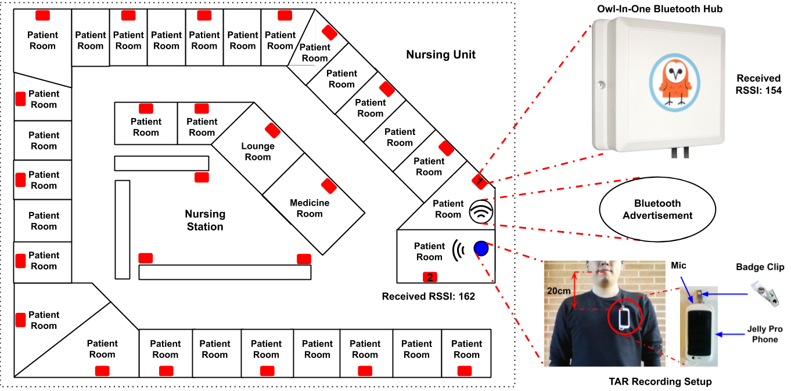
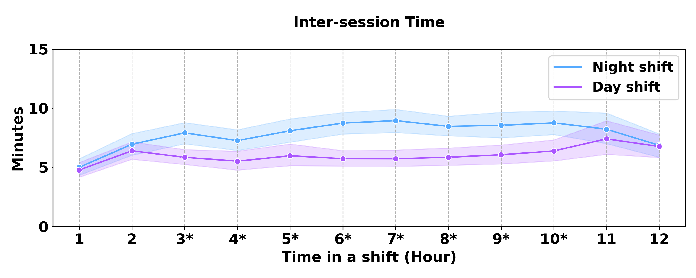
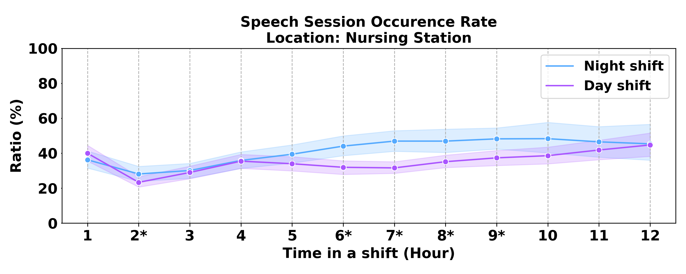
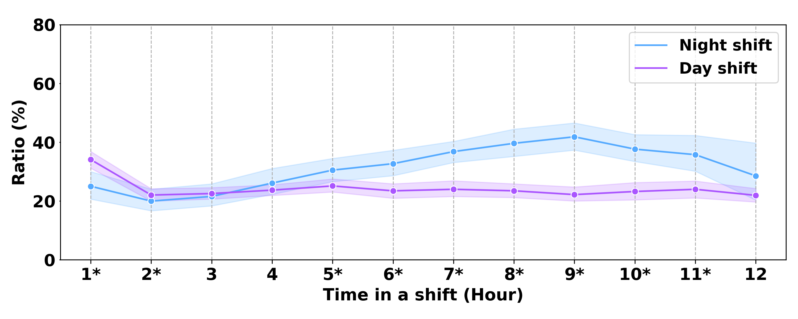

# tiles-audio-arousal
TILES arousal rating using audio data

## Table of Contents
* Installation
* Study Overview
* Preprocessing
* Analysis
* Machine Learning Experiment
* Contact

## Study Overview

"TILES: Tracking Individual Performance with Sensors" study is to examine the physiological, environmental, and behavioral variables affecting job performance and employee wellness. In this work, we use a audio badge sensor called TAR that captures audio features from the participants. We also have installed BLE-proximity system to track the indoor locations of the participant. 

Here is an example layout:

<div align="center">
 
</div>


## Preprocessing

The preprocessing includes different modality:

* Location
* Audio
* Physio

### Location

To process the location data, we run the following:

```
cd location
taskset 100 python3 process_location.py
```

The above scripts process participant-based localization metric per minute. The available location types are: 

* ns (nursing station)
* pat (patient room)
* other


### Audio

To process the audio data and get the rating, we run the following:

```
cd arousal_rating
taskset 100 python3 process_fg_mask.py --fg_threshold 0.5
taskset 100 python3 process_baseline.py --fg_threshold 0.5
taskset 100 python3 process_rating.py --fg_threshold 0.5
```

fg_threshold defines posterior of the fg speech prediction. 


* process_fg_mask.py: return fg features with fg posterior above threshold (default: 0.5)
* process_baseline.py: aggregate each participant's pitch, intensity, and HF/LF features
* process_rating.py: process ratings for each speech snippet


### Speaking Patterns

To extract speaking patterns, use the following:

```
cd analysis
python3 process_shift_feat.py --fg_threshold 0.5
python3 extract_arousal_feat.py --fg_threshold 0.5
```

* process_shift_feat.py: process features for each segment in a shift
* extract_arousal_feat.py: extract features for each participant


### Statistical analysis and dynamic plot

* compare_speaking_pattern.py: compare speaking patterns to shift, ICU/non-ICU
* plot_speaking_pattern.py: plot speaking patterns in a shift


Example plots about inter session time:

<div align="center">
 
</div>


Example plots about speech activity occurrence at the nursing station:

<div align="center">
 
</div>

Example plots about positive arousal speech ratio:

<div align="center">
 
</div>


### ML experiments
```
python3 fitbit/process_fitbit_feature.py
cd ml
python3 extract_ml_feature.py --fg_threshold 0.5
python3 igtb_prediction.py --fg_threshold 0.5
```


## Contact
Tiantian Feng, SAIL Lab, Univerisity of Southern California, email: tiantiaf@usc.edu or tiantiaf@gmail.com
